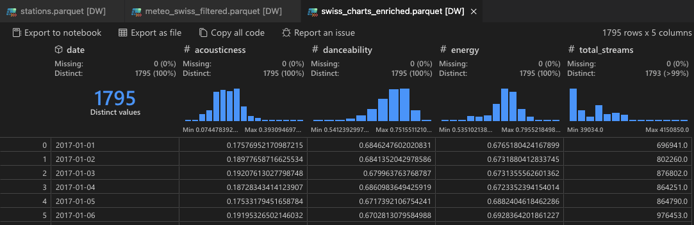
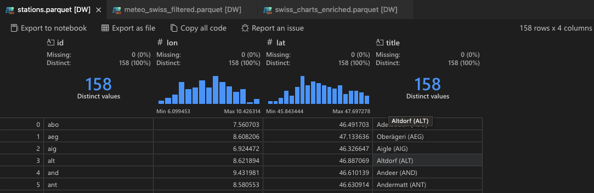
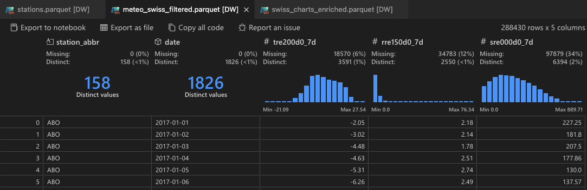

### ## Project Specification: "Sonic Weather"

This document details the implementation of "Sonic Weather," an interactive data visualization exploring the correlation between the mood of popular music and weather patterns across Switzerland.


#### **Project Goal & Narrative**

The project's goal is to create a compelling, narrative-driven visualization that investigates the hypothesis: *"Does the average **energy** and **valence** of top-charting songs in Switzerland correlate with sunny vs. rainy days?"* The user experience will be a "scrollytelling" journey, guiding the user through the data to a final conclusion.

#### **Data Pipeline (Jupyter Notebook or py script)**

One-time data processing script will read raw data, enrich it, and save it in an efficient format for the backend.

* **Process:**
    1.  **Enrich Spotify Data:** Combine the two kaggle datasets [Spotify Charts](https://www.kaggle.com/datasets/dhruvildave/spotify-charts?resource=download) and [Spotify Tracks DB](https://www.kaggle.com/datasets/zaheenhamidani/ultimate-spotify-tracks-db), in order to combine features like `danceability` and `energy` with the number of streams from the charts dataset for Switzerland.
    2.  **Aggregate Weather Data:** From [Meteo Schweiz STAC API](https://opendatadocs.meteoswiss.ch/a-data-groundbased/a1-automatic-weather-stations) download the daily historic data for the same timerange the spotify data is available. Meteo offers individual daily aggregated values for each measuring station in Switzerland including its coordinates. The following variables look interesting and relevenat for this visualization:
        * `tre200d0`: Daily mean temperature at 2m height (°C)
        * `rre150d0`: Daily total precipitation (mm)
        * `sre000d0`: Daily total sunshine duration (hours)
    3.  **Final Aggregation:**
        For simoplicity I aim to provide three data files directly in the frontend:
        * `meteo_stations.csv`: A static list of all weather stations with their metadata (name, coordinates).
        * `meteo_swiss_filtered.csv`: The daily weather data for all stations, filtered to the date range of the spotify data.
        * `swiss_charts_enriched.csv`: The daily aggregated spotify data for Switzerland, enriched with audio features.

#### **Frontend Application (React & TypeScript)**

The frontend will be built with **TypeScript** for improved type safety and developer experience, especially when handling complex data structures from the API.

* **Core Libraries:** `react`, `typescript`, `deck.gl`, `react-map-gl`, `recharts`, and simple `html`, `css` and `JS` .

* **Component Structure & Visualization:**
    * **`MapVisualization (deck.gl)`:** This component renders the main visual, which should show the map of Switzerland with the daily weather pattern encoded visually.
        * **Base Map:** A dark-themed base map from maptiler, rendered with `react-map-gl`.
        * **Weather Glyph Layer:** A custom `deck.gl` layer will render a glyph at each station's location, encoding three weather variables simultaneously for a high-impact visual:
            * **Temperature:** Mapped to the **height** of a `ColumnLayer` glyph. Taller columns mean warmer temperatures.
            * **Sunshine:** Mapped to the **color** of the column. A `d3-scale-chromatic` color scale (e.g., `interpolateYlOrRd`) will transition from a cool blue/grey (no sun) to a bright yellow (lots of sun).
            * **Rainfall:** Encoded as a **pulsing blue ring** using a `ScatterplotLayer` rendered at the base of the column. The ring is only visible on days with precipitation, and its animation speed or opacity is proportional to the amount of rainfall, providing a clear, dynamic signal.
    * **`TimelineChart (recharts)`:** A line chart that displays the national average `danceability` and `valence` of songs over time. It will be synchronized with the map, and a vertical line will indicate the currently selected date.

## Setup

This repo uses react for the frontend part and uv/python for the data processing part.

```bash
pnpm create vite@latest my-app -- --template react

uv init
```

## Data Loading

Spotify data is loaded from Kaggle datasets using the `kagglehub` library. The processed data is saved in the `frontend/public/data` directory for easy access by the frontend application.

### Spotify Data Preview


---
### Meteo Stations Data Preview



### Meteo Weather Data Preview

